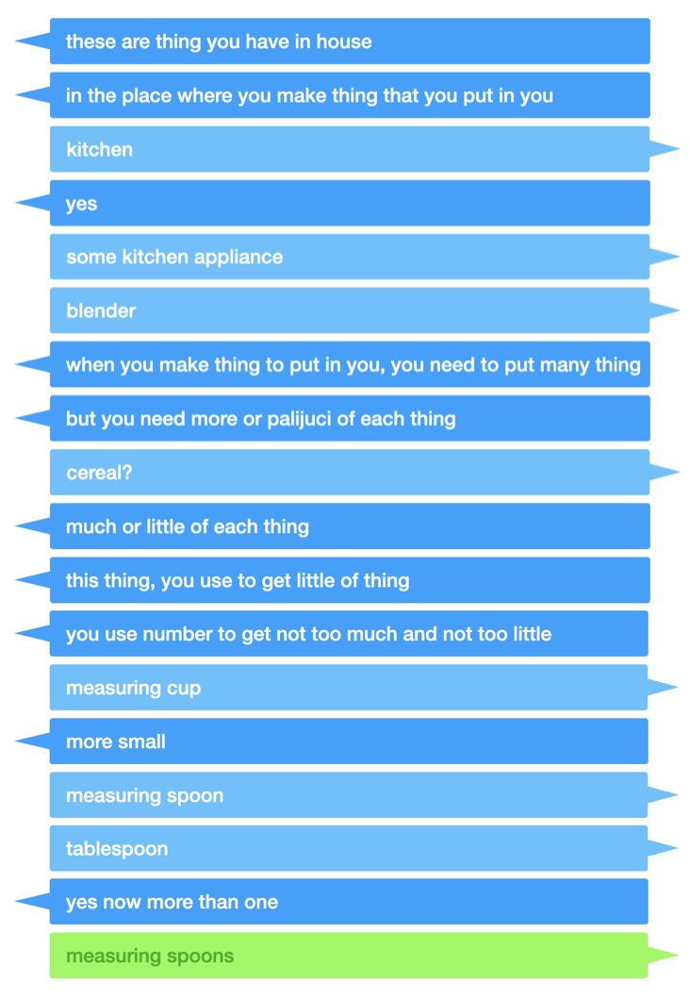

# Abstractionary

## What is this?

**Abstractionary** is an open-source game in which you have to try and explain complex ideas using very simple words. Partially inspired by Pictionary, Caveman Poetry and Taboo. 

Each round, one player is chosen as The Illiterate. They must pick a target phrase, and try to describe the target phrase to the other players using only the *most frequent* words in the English language. (The difficulty level of the game controls *how many* of the most frequent English words are allowed.) Any words that aren't among the most frequent will be replaced with gobbledygook. Once another player guesses the target word, the round has been won! 

Here's what a typical round looks like:

    

## How can I run my own server?

This app is fully Dockerized. Just clone the repo, run `docker compose build` and `docker compose up`. The game will be served locally on port `5001`.

If you want to use your own custom target word lists, that's pretty easy too! Just complete the following steps in your local repo:

1. Make a collection of target word lists as plain text files (`.txt`) with one word per line.
2. Open `py_app/data/topics.txt`.
3. Write a tab-separated row for each word list you want. The first column should be a short text identifier for the word list (no spaces), and the second should be a user-friendly description or title for the word list (spaces are okay). 
4. Add your word lists to `py_app/data/lists`. The name of each text file should be the first column of the corresponding row from `topics.txt`. 
5. Go into `py_app` and run `./build_db`.
6. Run the app as you normally would!

## Credits

Code written solely by myself (Franklin Pezzuti Dyer). Thanks to Althea Denlinger, Alex Adams and Ada Pezzuti Dyer for helping me test the game.

The lovely logo was drawn by Ada Pezzuti Dyer.

Player avatars taken from EmojiMix.
